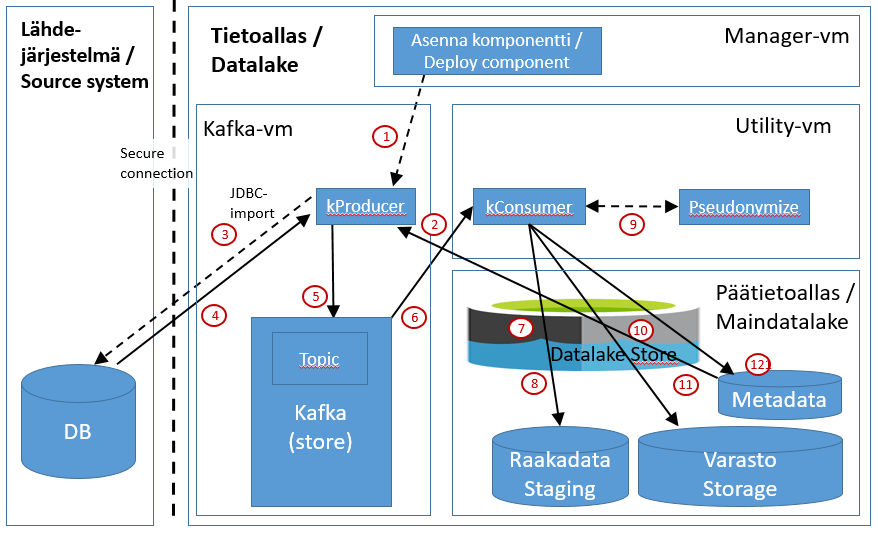

# JDBC/Kafka-inkrementaalilatauksen yleiskuvaus
Tämä dokumentti kertoo yleisesti mitä tapahtuu kun tietoaltaaseen ladataan dataa lähdejärjestelmästä käyttäen JDBC:tä.

Tiedon siirto lähdejärjestelmästä tietoaltaaseen tapahtuu alla olevan kuvan mukaisesti:

Kuvan komponentit ja toiminnallisuus on kuvattu alla olevissa kappaleissa.

## Komponentit
Kuvassa näkyvät komponentit kuvataan kappaleessa [Integraatiokuvien komponentit](int_komponentit.md)

# Toiminnallisuus
Tässä osassa kerrotaan yllä olevan kuvan toimintaperiaate. Alla olevat numerot viittaavat kuvan punaisiin ympäröityihin numeroihin.

## 1. Komponentin asennus (Manager - deploy component)
Integraation inkrementaalilataukseta vastaava komponentti on nimeltään "integraation_nimi[_instanssin_nimi]_inkr". 

* [Komponenttien asennus](int_2_4_asennus.md)

Jokainen komponentti asennetaan Manager-nodelta komponentin KayttoonOtto.md-dokumentin mukaisesti (löytyy komponentin juurihakemistosta GIT-repositorystä). JDBC-integraatioiden latauskomponentti asennetaan Headnode-palvelimelle.

## 2. Metadatan luku
Ennen inkrementaalilatausta luetaan integration_status-taulusta lista tauluista, joista inkrementaalilataus tehdään. Inkrementaalilataus suorittaa latauksen vain niistä tauluista, joissa arvona on jotain muuta kuin "EXCLUDE". Tällä tavalla voidaan hallita mistä tauluista inkrementaalilataus suoritetaan. 

## 3. Intetegraation haku lähdejärjestelmästä

Latauksen varsinainen logiikka on tässä vaiheessa. Muuttuneiden tietojen löytäminen nopeasti ja luotettavasti on latauksen kriittisin osa. Alla kuvataan tarkemmin minkälaisia logiikoita inkrementaalilatauksissa käytetään.

#### Inkrementaalilatauksen hakulogiikka (miten löydetään muutokset)
Säännöllisissä latauksissa tarkoituksena on siirtää pelkästään edellisen latauksen jälkeen muuttuneet tiedot. Integraation lataukseen liittyen tämä inkrementin muutos-logiikan määrittely ja toteutus on yleensä suurin työ. Tällä hetkellä alkulataukselle on kolmea eri tyyppiä: 
1. FULL_TABLE: Pienehköt ja staattisehkot referenssidatataulut ladataan kokonaan. Tätä joudutaan myös käyttämään jos ladattavalle taululle ei voida määritellä yksikäsitteistä tapaa löytää siitä uudet ja muuttuneet tiedot. Eli ei siis löydy 
  * aikaleimaa, joka kertoo milloin rivit on päivitetty,
  * milloin rivit on luotu ja taataan, että luotuihin riveihin ei tehdä muutoksia, tai
  * tarjota identifikaatiokenttää, jonka arvo kasvaa jokaisen uuden rivin kohdalla ja taataan, että olemassaoleviin riveihin ei tehdä muutoksia
2. TIME_COMPARISATION: Joissakin usein päivittyvissä tauluissa on suoraan käyttökelpoiset muutosaikaleimat, jotka kertovat milloin riviä on muutettu. Näiden taulujen muutokset havaitaan hakemalla rivit joiden muutosaikaleima on suurempi kuin edellisessä latauksessa ladattu suurin aikaleima. 
3. KEY_COMPARISATION: Uudet rivit haetaan perustuen kasvavaan kokonaislukuavainsarakkeeseen, joka on indeksoitu taulun avainkenttä (jokin_id). Jos muutos tehdään indeksöimättömästä kentästä haku saattaa kestää liian kauan toimiakseen. Uudet rivit siis ovat ne, joilla <jokin_id> on suurempi kuin mikään aiemmin ladattu. Tällaisissa tauluissa olemassa oleviin tietoihin ei tehdä muutoksia. 
4. HISTORY_TABLE_LOOKUP: Tämän on puhtaasti integraatiospesifinen menetelmä, jossa muutokset varsinaisiin datatauluihin saadaan erillisestä muustoshistoriataulusta. Kun johonkin tauluun tulee muutos, niin tämä muutos kirjataan muutos_tauluun, minimitiedot ovat
  * taulun nimi, jossa muutos tapahtui
  * aikaleima, jolloin muutos tehtiin
  * tieto, avaimesta, jolla viitataan data-tauluun
  * avaimen arvo, jolla viitataan yksikäsitteisesti data-taulun muuttuneeseen riviin

#### Inkrementaalilatauksen ajastus
Inkrementaalilatausten intervallia voidaan hallita kahdella tavalla:
  1. Integraatiotasoinen tarkkaan määritelty toistuva kellonaika, jolloin data ladataan

    * Aika voidaan määritellä cron-tyyppisesti, eli valitaan minuutit/tunnit/päivät/viikonpäivät/viikko, jolloin lataus suoritetaan
    * Tämän tyyppinen lataus kattaa integraation kaikki taulut - määrättyä aikaa ei voi konfiguroida taulukohtaiseksi

Joillekin integraatioille on määritelty vielä muitakin lataustyyppejä. Ne on kuvattu integraatiokohtaisesti

  2. Taulukohtainen jatkuvalataus
Integraatiometadatassa on parametri, jonka avulla voi ohjata inkrementaalilatauksen intervallia taulukohtaisesti. integration_status.interval-kentän arvoon kirjataan intervalli minuutteina. Minimiarvo 5 minuuttia.  

    * Jokaiselle taululle voidaan integraation sisällä määritellä milloin taulun muutokset ladataan suhteessa edelliseen lataukseen. Inkrementaalilatausprosessi pitää kirjaa koska se on tehnyt edellisen latauksen. Nyt tämä latausintervalli kertoo kuinka pian jo tehdyn inkrementaalilatauksen jälkeen tehdään uusi lataus. 
    * Inkrementaaliprosessi aktivoituu tietyin ajoin (esim. 5 min) ja ennen latausta skannaa kaikkien integraatioiden taulujen edellisen lataushetken ja päätteleen sen, nykyhetken ja määritellyn latausintervallin avulla mille tauluille suoritetaan inkrementaalilataus. 

## 4. Datan lataus lähdejärjestelmästä (Kafka-vm - JDBC-import)

Tietoaltaan kProducer lataa lähdejärjestelmästä datan JDBC-yhteyden yli. 

## 5. Datan syöttö Kafkalle (Sftp - kProducer)
kProducer syöttää ladatun datan Kafkalle oikealle Topicille (integraatiokohtainen) [Avro](https://avro.apache.org/)-formaatissa. 

## 6. Datan luku Kafkasta (Utility - kConsumer)
Geneerinen kConsumer käy määräajoin (konfiguroitavissa) tarkastamassa onko sen seuraamaan Topic:iin (1-n) on saapunut uutta dataa. 
 
## 7. Raaka-datan prosessointi Azuren DataLake Storeen (Utility - kConsumer)
kConsumer tallentaa Kafkasta lukemansa datan ensin Azure DataLake Storeen [ORC](https://orc.apache.org/docs/)-formaattiin. Talletettu data on nähtävissä Azuren portalin kautta integraatiospecifisessä kansiossa (/cluster/maindatalake/staging/<integraatio>). Alkulatauksen tiedostot on integraation juurikansiossa ja ikrementtien data alihakemistossa "inc".  

## 8. Datan tallennus raakadata-altaaseen (Headnode, Hive - Raakadata/Staging)
kConsumer kirjoittaa datan DataLake Storen lisäksi hiven raakadata-altaaseen sellaisenaan. Hivessä data on talletettuna relaatiotietokannan mukaisesti tauluihin. Hiven:n tietokannan nimi on "staging_integraatio". Dataa voi tarkastella Hiven CLI-sovellusilla (esim. [Beeline](https://cwiki.apache.org/confluence/display/Hive/HiveServer2+Clients#HiveServer2Clients-Beeline–CommandLineShell)) hql-kyselyiden avulla. 

## 9. Datan pseudonymisointi
kConsumer päättelee dataan liittyvän metadatan perusteella tuleeko data pseydonymisoida vai ei, ja kutsuu ennen datan varastoon tallentamista Pseudonymisointi-palvelua jos pseudonymisoitavaa dataa löytyy. Pseudonymisoinnista löytyy lisätietoja: [Metadata - yleisesitys](03_metadata.md)

## 10. Varasto-datan prosessointi Azuren DataLake Storeen (Utility - kConsumer, Päätietoallas)
kConsumer tallentaa Kafkasta lukemansa ja pseudonymisoidun datan myös Azure DataLake Storeen [ORC](https://orc.apache.org/docs/)-formaattiin. Talletettu data on nähtävissä Azuren portalin kautta integraatiospecifisessä kansiossa (/cluster/maindatalake/storage/<integraatio>). Alkulatauksen tiedostot on integraation juurikansiossa ja ikrementtien data alihakemistossa "inc". 

## 11. Datan tallennus varastoaltaaseen (Utility, Päätietoallas, Hive - Varasto/Storage)
Pseudonymisoinnin jälkeen data talletetaan vastastoaltaaseen. Varastoaltaan tietomalli on sama kuin raakadata-altaassa. Hivessä data on talletettuna relaatiotietokannan mukaisesti tauluihin. Hiven:n tietokannan nimi on "varastp_<integraatio>_historia_log". Dataa voi tarkastella Hiven CLI-sovellusilla (esim. [Beeline](https://cwiki.apache.org/confluence/display/Hive/HiveServer2+Clients#HiveServer2Clients-Beeline–CommandLineShell)) hql-kyselyiden avulla. 

## 12. Metadatan päivitys

Inkrementilatauksen jälkeen päivitetään integraatio-specifistä hallintakantaa, johon merkitään inkrementaalilatauksen yksityiskohdat: koska viimeisin lataus tehty ja mikä oli latauksen avainkenttien arvot (viimeisin käytetty id tai aikaleima). Näiden tietojen avulla inkrementaalilataus osaa seuraavalla kerralla jatkaa oikeasta kohdasta. Täyslatauksen kohdalla näitä tietoja ei tarvita.
